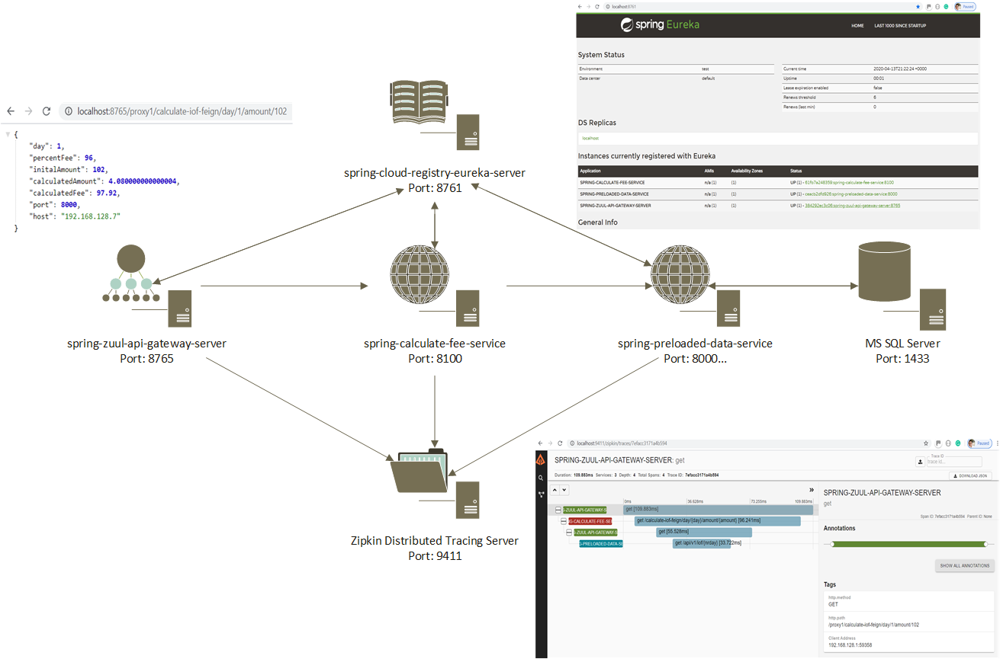

# Overview


The main project use the spring cloud "features" described bellow:


* Netflix Eureka Server (Service Discovery)
* Netflix Eureka Client (Service Discovery)
* Sleuth (Distributed Trace)
  * Zipkin
* Feign (Autoconfigure and bind spring environment)



Some endpoints to test the solution

| URL                                                          | PORT                             | DESCRIPTION                                      | PROJECT                             |
| ------------------------------------------------------------ | -------------------------------- | ------------------------------------------------ | ----------------------------------- |
| http://localhost:8761/                                       | 8761                             | Eureka Server                                    | spring-cloud-registry-eureka-server |
| http://localhost:9411/zipkin/                                | 9411                             | Zipkin Distributed Tracing Server                | docker install                      |
| http://localhost:8765/proxy1/calculate-iof-feign/day/1/amount/102 | 8765                             | Netflix Zull API Gateway                         | spring-zuul-api-gateway-server      |
| http://localhost:8100/calculate-iof-feign/day/1/amount/102   | 8100, 8101, 8102...              | Calculate IOF Fee                                | spring-calculate-fee-service        |
| http://localhost:8000/api/v1/iof/2                           | 8000, 8001, 8002...              | IOF reference values (Used to calculate IOF fee) | spring-preloaded-data-service       |
| http://localhost:15672/#/                                    | * 5672 (AMQP) <br />* 15672 (UI) | RabbitMQ                                         | docker install                      |

If you are interested, I created 2 more projects to show other features:

* Config Server (Configuration)
* BUS (Broadcast configuration changes)
* Netflix Hystrix (Circuit Breaker)


| URL                                               | PORT | DESCRIPTION                                          | PROJECT                    |
| ------------------------------------------------- | ---- | ---------------------------------------------------- | -------------------------- |
| http://localhost:8888/spring-limits-service/qa    | 8888 | Spring Cloud Config  (Show the configuration values) | spring-cloud-config-server |
| http://localhost:8080/actuator/refresh            | 8080 | Refresh configuration but not apply to all nodes     | spring-limits-service      |
| (POST) http://localhost:8080/actuator/bus-refresh | 8080 | BUS (Refresh configuration in all nodes)             | spring-limits-service      |
| http://localhost:8080/limits                      | 8080 | Example client using cloud config                    | spring-limits-service      |
| http://localhost:8080/limits-fault-tolerance      | 8080 | Hystrix - Fault Tolerance                            | spring-limits-service      |


# Setup Project (main project)

First you have to run the command bellow that will install and prepare the third applications

*  MS SQL Server
  * The script will create our database and tables 
* Rabbit MQ
* Zipikin

go to folder **_docker-setup** and execute the command bellow:

> docker-compose up

```
PS C:\workspaces\eclipse-workspace\spring-cloud-docker\_docker-setup> docker-compose up                                                                                                                                                                                        Creating network "nt_backend" with the default driver
Creating volume "docker-setup_sqldata" with default driver
Creating docker-setup_sqlserverdb_1 ... done          
Creating docker-setup_rabbitmq_1    ... done                                             Creating docker-setup_zipkin-server_1 ... done                                           Attaching to docker-setup_sqlserverdb_1, docker-setup_rabbitmq_1, docker-setup_zipkin-server_1
docker-setup_sqlserverdb_1 | importing data will start in 60s...
...
```


build and create packages of our applications (folder **spring-cloud-docker**)

> mvn clean package

```
PS C:\workspaces\eclipse-workspace\spring-cloud-docker> mvn clean package
[INFO] Scanning for projects...
[INFO] ------------------------------------------------------------------------
[INFO] Reactor Build Order:
[INFO]
[INFO] spring-cloud-registry-eureka-server                                [jar]
[INFO] spring-zuul-api-gateway-server                                     [jar]
[INFO] spring-cloud-config-server                                         [jar]
[INFO] spring-limits-service                                              [jar]
[INFO] spring-preloaded-data-service                                      [jar]
[INFO] spring-calculate-fee-service                                       [jar]
[INFO] spring-cloud-docker                                                [pom]
[INFO]
[INFO] --< com.h3b.investment.discovery:spring-cloud-registry-eureka-server >--
[INFO] Building spring-cloud-registry-eureka-server 0.0.1-SNAPSHOT        [1/7]
[INFO] --------------------------------[ jar ]---------------------------------
...
...
...
[INFO]
[INFO] Results:
[INFO]
[INFO] Tests run: 1, Failures: 0, Errors: 0, Skipped: 0
[INFO]
[INFO]
[INFO] --- maven-jar-plugin:3.1.2:jar (default-jar) @ spring-calculate-fee-service ---
[INFO] Building jar: C:\workspaces\eclipse-workspace\spring-cloud-docker\spring-calculate-fee-service\target\spring-calculate-fee-service-0.0.1-SNAPSHOT.jar
[INFO]
[INFO] --- spring-boot-maven-plugin:2.2.6.RELEASE:repackage (repackage) @ spring-calculate-fee-service ---
[INFO] Replacing main artifact with repackaged archive
[INFO]
[INFO] ---------------< com.h3b.investment:spring-cloud-docker >---------------
[INFO] Building spring-cloud-docker 1.0-SNAPSHOT                          [7/7]
[INFO] --------------------------------[ pom ]---------------------------------
[INFO]
[INFO] --- maven-clean-plugin:2.5:clean (default-clean) @ spring-cloud-docker ---
[INFO] ------------------------------------------------------------------------
[INFO] Reactor Summary:
[INFO]
[INFO] spring-cloud-registry-eureka-server 0.0.1-SNAPSHOT . SUCCESS [ 44.683 s]
[INFO] spring-zuul-api-gateway-server 0.0.1-SNAPSHOT ...... SUCCESS [01:05 min]
[INFO] spring-cloud-config-server 0.0.1-SNAPSHOT .......... SUCCESS [ 31.379 s]
[INFO] spring-limits-service 0.0.1-SNAPSHOT ............... SUCCESS [ 36.419 s]
[INFO] spring-preloaded-data-service 0.0.1-SNAPSHOT ....... SUCCESS [ 49.236 s]
[INFO] spring-calculate-fee-service 0.0.1-SNAPSHOT ........ SUCCESS [01:06 min]
[INFO] spring-cloud-docker 1.0-SNAPSHOT ................... SUCCESS [  0.128 s]
[INFO] ------------------------------------------------------------------------
[INFO] BUILD SUCCESS
[INFO] ------------------------------------------------------------------------
[INFO] Total time:  04:54 min
[INFO] Finished at: 2020-04-13T15:37:01-04:00
[INFO] ------------------------------------------------------------------------
```

**CREATE and START** our container applications (folder **spring-cloud-docker**)

> mvn clean package


```
PS C:\workspaces\eclipse-workspace\spring-cloud-docker> docker-compose up                 Building eureka-registry-server
Step 1/4 : FROM java:8
 ---> d23bdf5b1b1b
Step 2/4 : EXPOSE 8761
 ---> Running in 0e040f788987
Removing intermediate container 0e040f788987
 ---> 1c4f6b725105
Step 3/4 : ADD /target/spring-cloud-registry-eureka-server-0.0.1-SNAPSHOT.jar spring-cloud-registry-eureka-server.jar
 ---> 4948bc11f682
Step 4/4 : ENTRYPOINT ["java", "-jar", "spring-cloud-registry-eureka-server.jar"]
 ---> Running in ad82afd81650
Removing intermediate container ad82afd81650
 ---> 4348ff34d25c

Successfully built 4348ff34d25c
Successfully tagged spring-cloud-registry-eureka-server:beta
WARNING: Image for service eureka-registry-server was built because it did not already exist. To rebuild this image you must use `docker-compose build` or `docker-compose up --build`.
Building zuul-api-gateway-server
Step 1/4 : FROM java:8
 ---> d23bdf5b1b1b
Step 2/4 : EXPOSE 8765
 ---> Running in 7ad3a1f84d31
Removing intermediate container 7ad3a1f84d31
 ---> e8b62b796808
Step 3/4 : ADD /target/spring-zuul-api-gateway-server-0.0.1-SNAPSHOT.jar spring-zuul-api-gateway-server.jar
 ---> b8aee6a1e038
Step 4/4 : ENTRYPOINT ["java", "-jar", "spring-zuul-api-gateway-server.jar"]
 ---> Running in 5782acd27d8b
Removing intermediate container 5782acd27d8b
 ---> 1d8791253a20

Successfully built 1d8791253a20
Successfully tagged spring-zuul-api-gateway-server:beta
WARNING: Image for service zuul-api-gateway-server was built because it did not already exist. To rebuild this image you must use `docker-compose build` or `docker-compose up --build`.
Building preloaded-data-service
Step 1/4 : FROM java:8
 ---> d23bdf5b1b1b
Step 2/4 : EXPOSE 8000
 ---> Running in fcb632498e06
Removing intermediate container fcb632498e06
 ---> 5918539c5db5
Step 3/4 : ADD /target/spring-preloaded-data-service-0.0.1-SNAPSHOT.jar spring-preloaded-data-service.jar
 ---> 8ce5af07b92c
Step 4/4 : ENTRYPOINT ["java", "-jar", "spring-preloaded-data-service.jar"]
 ---> Running in 2b88f4df7442
Removing intermediate container 2b88f4df7442
 ---> 0164e5336156

Successfully built 0164e5336156
Successfully tagged spring-preloaded-data-service:beta
WARNING: Image for service preloaded-data-service was built because it did not already exist. To rebuild this image you must use `docker-compose build` or `docker-compose up --build`.
Building spring-calculate-fee-service
Step 1/4 : FROM java:8
 ---> d23bdf5b1b1b
Step 2/4 : EXPOSE 8100
 ---> Running in ab5e3b22e822
Removing intermediate container ab5e3b22e822
 ---> 0475367cd2ab
Step 3/4 : ADD /target/spring-calculate-fee-service-0.0.1-SNAPSHOT.jar spring-calculate-fee-service.jar
 ---> ebe5ce28fac3
Step 4/4 : ENTRYPOINT ["java", "-jar", "spring-calculate-fee-service.jar"]
 ---> Running in 0c076494d851
Removing intermediate container 0c076494d851
 ---> 38be159ace4d

Successfully built 38be159ace4d
Successfully tagged spring-calculate-fee-service:beta
WARNING: Image for service spring-calculate-fee-service was built because it did not already exist. To rebuild this image you must use `docker-compose build` or `docker-compose up --build`.
Creating spring-cloud-docker_eureka-registry-server_1 ... done
Creating spring-cloud-docker_zuul-api-gateway-server_1 ... done
Creating spring-cloud-docker_preloaded-data-service_1  ... done
Creating spring-cloud-docker_spring-calculate-fee-service_1 ... done
Attaching to spring-cloud-docker_eureka-registry-server_1, spring-cloud-docker_zuul-api-gateway-server_1, spring-cloud-docker_preloaded-data-service_1, spring-cloud-docker_spring-calculate-fee-service_1
...
...
...
```


**STOP** our container applications (folder **spring-cloud-docker**)

> docker-compose down --rmi all


```
PS C:\workspaces\eclipse-workspace\spring-cloud-docker> docker-compose down --rmi all     Removing spring-cloud-docker_spring-calculate-fee-service_1 ... done                     Removing spring-cloud-docker_preloaded-data-service_1       ... done                     Removing spring-cloud-docker_zuul-api-gateway-server_1      ... done                     Removing spring-cloud-docker_eureka-registry-server_1       ... done                     Network nt_backend is external, skipping
Removing image spring-cloud-registry-eureka-server:beta
Removing image spring-zuul-api-gateway-server:beta
Removing image spring-preloaded-data-service:beta
Removing image spring-calculate-fee-service:beta
```

